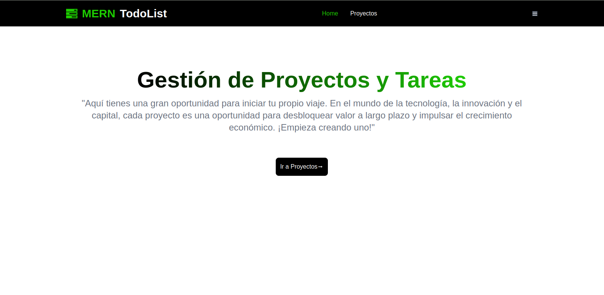
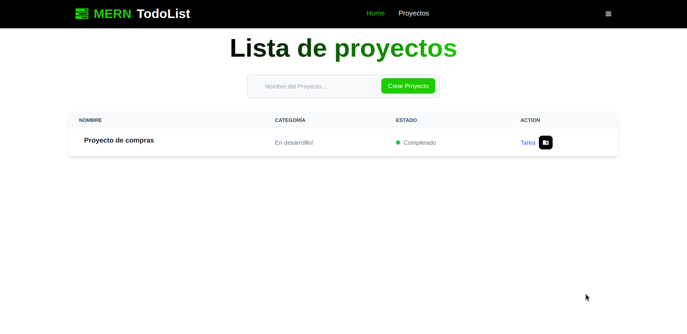
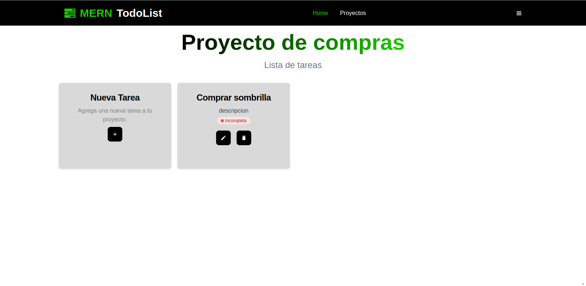

# Gestión de Proyectos y Tareas

<div>

</div>

<details closed>
  <summary><b>Captura proyecto</b></summary>
  
 
>
</details>

<details closed>
  <summary><b>Captura tareas de proyecto</b></summary>
  
 
>
</details>

## Descripción

Gestión de Proyectos y Tareas es una aplicación web completa diseñada para que los usuarios pueden crear proyectos, asignar tareas a esos proyectos, y gestionar el estado de las tareas para asegurar que todos los miembros del equipo estén al tanto de las responsabilidades y el progreso.

## Tecnologías Utilizadas

### client

- React: Para la construcción de la interfaz de usuario.
- Context API: Para el manejo del estado global de la aplicación.
- React Router: Para la navegación entre las diferentes partes de la aplicación.
- Tailwind CSS: Para el diseño y estilos de la aplicación.

### server

- Node.js y Express: Para el backend y la API.
- MongoDB: Para la base de datos.
- Mongoose: Para la modelación de datos en MongoDB.
- JWT (JSON Web Tokens): Para la autenticación y autorización.
- bcryptjs: Para el cifrado de contraseñas.
- express-validator: Para la validación de datos de entrada.
- dotenv: Para la gestión de variables de entorno.

## Instalación

### Requisitos

- Node.js (versión 14 o superior)
- MongoDB (versión 4.2 o superior)

### Pasos

1. Clona el repositorio:

```javascript
git clone https://github.com/DaniDeDos/MERN-TodoList.git
```

2. Navega al directorio del server:

```javascript
cd server/
```

3. Navega al directorio del client:

```javascript
cd client/
```

4. Instala las dependencias:

```javascript
yarn install
```

5. Crea un archivo `.env` en la raíz del proyecto con las variables de entorno necesarias (por ejemplo, `DB_MONGO` para la cadena de conexión a MongoDB y `SECRETO` para JWT) en el server.

- el mismo paso en el client

6. Inicia el servidor de desarrollo:

- client/

  ```javascript
  yarn start
  ```

- server/
  ```javascript
  yarn start
  ```

7. Abre tu navegador y visita la aplicación en acción.

## Uso

Una vez que la aplicación esté en marcha, puedes comenzar a crear proyectos y tareas. La API permite operaciones CRUD (Crear, Leer, Actualizar, Eliminar) para proyectos y tareas, así como autenticación y autorización de usuarios.

## Contribuir

Si estás interesado en contribuir a este proyecto, por favor sigue estos pasos:

1. Haz un fork del repositorio.
2. Crea una nueva rama con tu característica (`git checkout -b feature/nombre-de-la-caracteristica`).
3. Haz commit de tus cambios (`git commit -am 'Añadir alguna característica'`).
4. Haz push a la rama (`git push origin feature/nombre-de-la-caracteristica`).
5. Crea un nuevo Pull Request.

## Contacto

Si tienes alguna pregunta o sugerencia, no dudes en abrir un issue en este repo.

